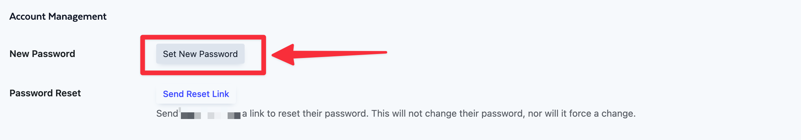
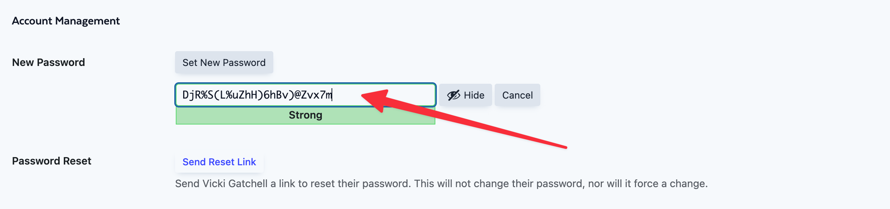
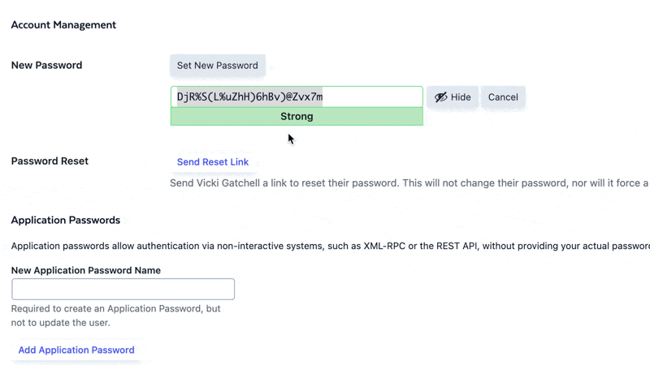

# Change your Password

import ReactPlayer from 'react-player';

<ReactPlayer url="https://vimeo.com/1009260778"
    width="100%"
    height="100%"
    controls={true}
    playing={true}
    muted={true}
     />

Digital Church doesn't have access to view your password for you. Passwords are fully encrypted, so they are secure for you and you alone. So if you forget your password, you may need to reset it.

## When You Are Not Logged In

If you aren't logged into the site, then you can request a secure password reset link via email by putting your email address in the field on the password reset page. You can generally find that page by adding /password to the end of your domain URL.

## When You Are Logged In

### 1. Navigate to the profile page in your dashboard.

Go to **Dashboard > People > My Profile**. It should be something like https://yourdigital.church/wp-admin/profile.php (with your domain).

### 2. Set a New Password

Scroll down to the Account Management section and click the "Set New Password" button.

### 3. Copy your Password

The system will generate a strong password for you. You can either plan to use this password or type your own password in the box.

### 4. Save your Changes

Click the the "Update User" button to save your changes. Be sure to store your password somewhere secure, and if you have administrative access to your website, it's very important that you use a strong password.

You might want to take a moment to log out and back in just to make sure your changes were saved.