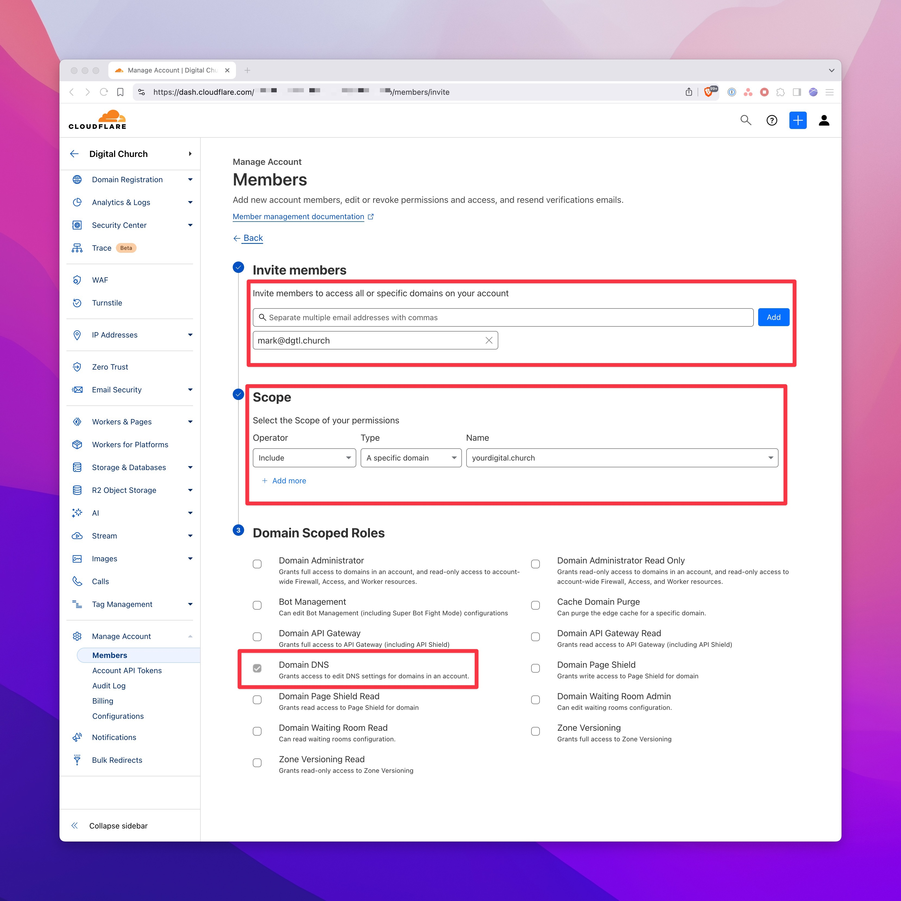

# Cloudflare Invitation

If you manage your domain DNS records in Cloudflare, you may need to add an invitation to the [Digital Church](https://digitalchurch.com) team. This guide will show you how to do that. 

### 1. Log into Cloudflare Account

Log into your Cloudflare account. If you have multiple account access, select the account you want to add the invitation to.

### 2. Select Manage Account > Members

In the left sidebar, select **Manage Account** > **Members**.

### 3. Select the Invite Button

Select the **Invite** button.

### 4. Enter the Email Address

Enter the email address of the person you want to invite. If you are inviting the [Digital Church](https://digitalchurch.com) team, use the email address mark@digitalchurch.com. Set the scope to include the domain you want to invite them to. Be sure to check the box to allow the user to manage the domain DNS records.

### 5. Continue to Summary & Invite

Continue to the summary page and select **Invite**.