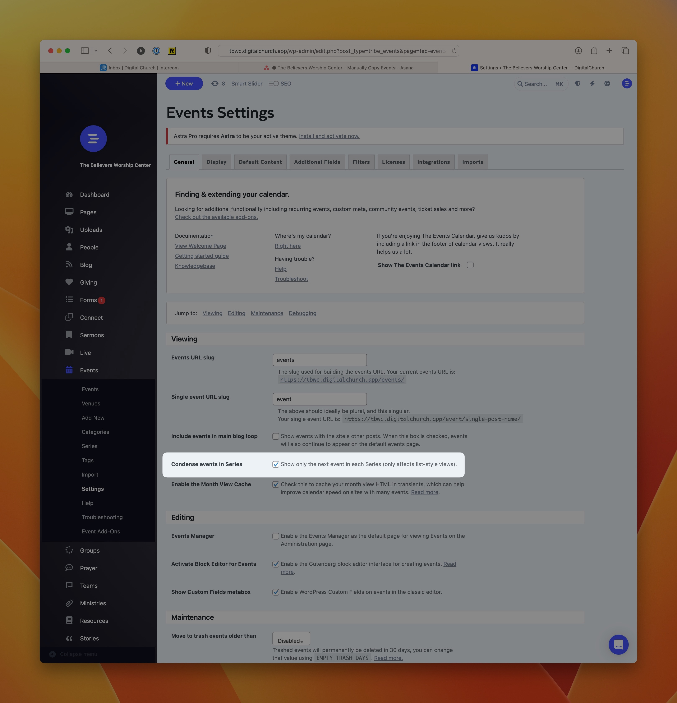

# Display Only the Next Recurring Event on your Calendar



In list views of the calendar, there may be times when you want to condense the list by only showing the next occurance of a recurring event series. Luckily, that's possible with a simple setting in the dashboard.

1. Navigate to **Dashboard > Events > Settings**
    ```html
    https://your-subdomain.digitalchurch.app/wp-admin/edit.php?post_type=tribe_events&page=tec-events-settings&tab=general
    ```
2. Select the option that reads "Show only the next event in each Series (only affects list-style views)."
3. Scroll down and press the **Save Changes** button.