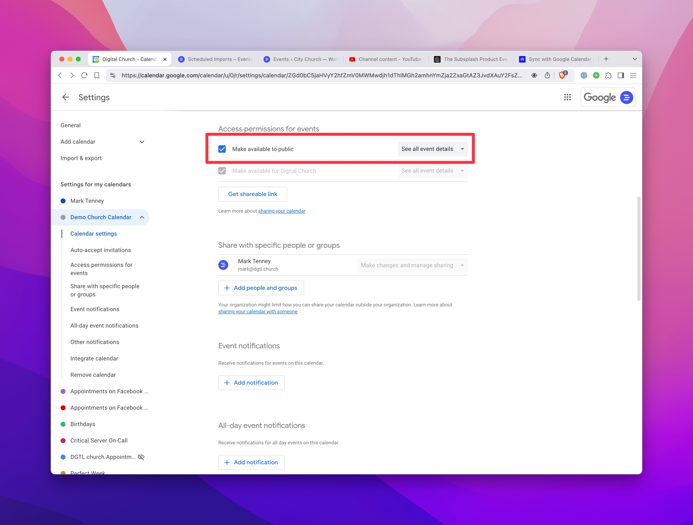
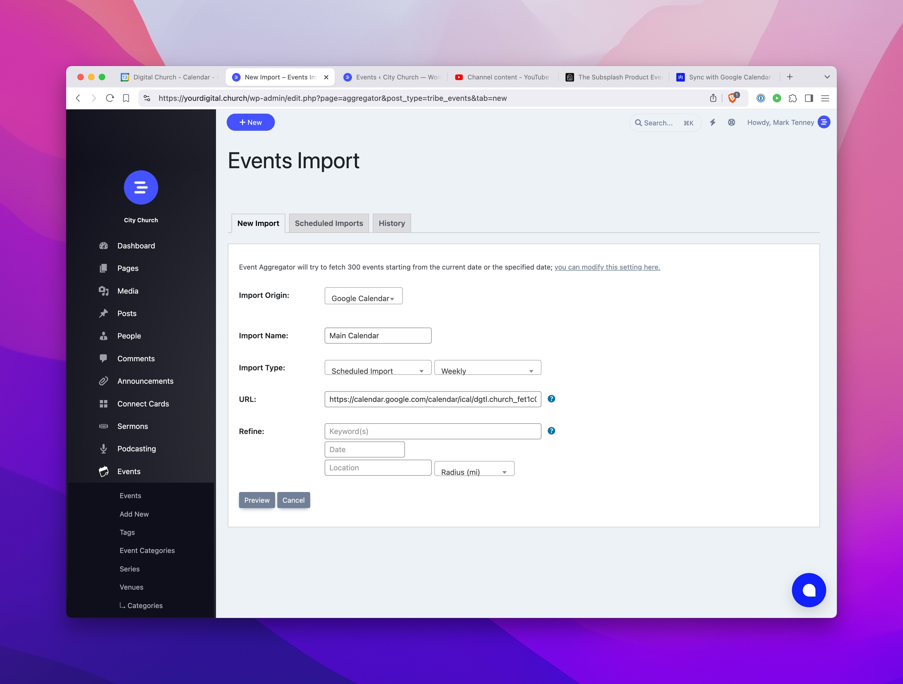

# Sync Events with Google Calendar

import ReactPlayer from 'react-player';

<ReactPlayer url="https://youtu.be/VU9l0p-HveU"
    width="100%"
    height="100%"
    controls={true}
    playing={true}
    muted={true}
     />

Perhap you'd rather manage your events in Google Calendar, but still want to use our event management system. Luckily, you can set up a sync between the two. Here's how:

### 1. Access your Google Calendar

Login to https://calendar.google.com/ and click on the three vertical dots next to the calendar you want to sync.

### 2. Make the Calendar Public

Make sure the calendar is set to "Public" so that we can access it.

### 3. Get the ical URL

Copy the Public URL in ical format.

### 4. Setup the Import

Go to **Events > Import** and select **Google Calendar**. Set the sync to daily and paste the ical URL.

### 5. Preview and Import

Preview the import and then click **Import**.

