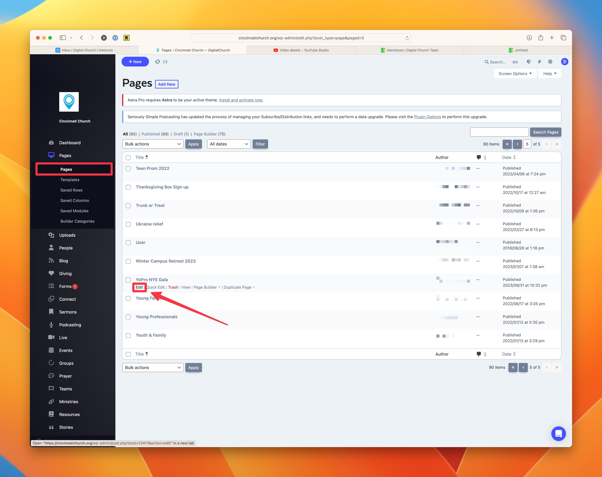
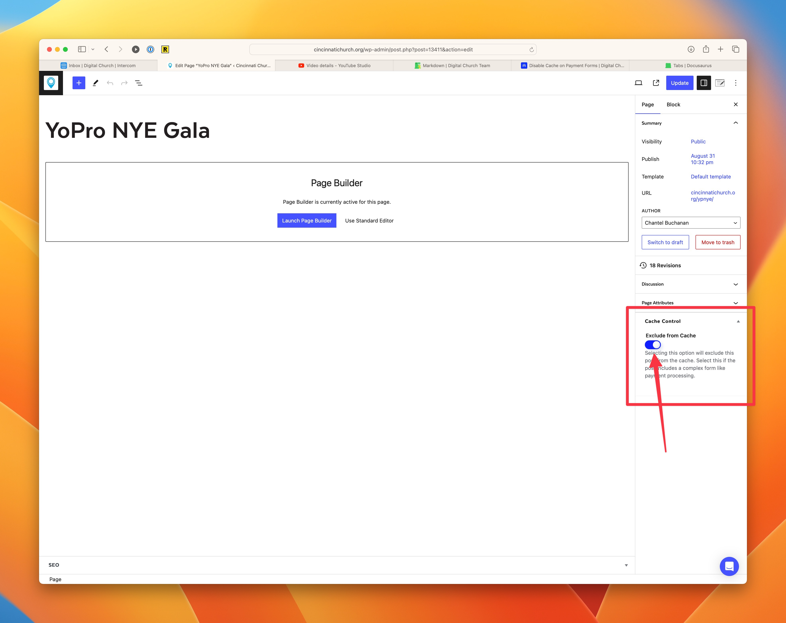
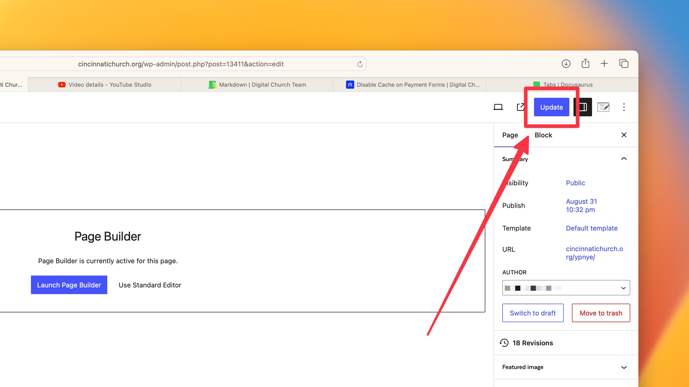

# Disable the Page Cache when using a Payment Field on your Form

import ReactPlayer from 'react-player';

<ReactPlayer url="https://youtu.be/Rdo_yXm0H1s"
    width="100%"
    height="100%"
    controls={true}
    playing={true}
    muted={true}
     />

When you are using a payment form, be sure to disable the cache on the page where you are embedding the form. If you don't disable the cache, you may lose payments because of form processing errors.

## Edit the Page you Embedded the Form on

import Tabs from '@theme/Tabs';
import TabItem from '@theme/TabItem';

<Tabs>
  <TabItem value="dashboard" label="Dashboard" default>
    In the dashboard menu, select Pages. Find the page you need to edit and click on the option to edit that page.
  </TabItem>
  <TabItem value="toolbar" label="Toolbar">
    While viewing the page where the form is embedded, hver over the Settings icon item in the toolbar and select <b>Edit Page Settings</b>.
  </TabItem>
  <TabItem value="command" label="Command Menu">
    Use <code>⌘</code> + <code>K</code> to open the command bar and type "Edit Pages" and hit return. Then find the page you need to edit in the listing and choose the option to edit it.
  </TabItem>
</Tabs>

## Select the option to Exclude from Cache

On the right column, find the option under the Cache Control heading to Exclude from Cache and switch it on.

## Update your Page to Finalize the Pages

On the top right corner, press the Update button.