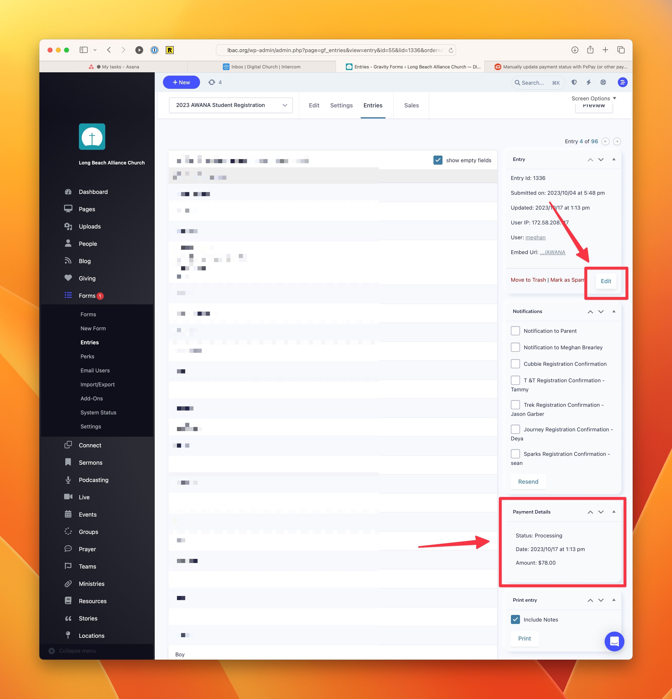

# Manually Change the Payment Status of a Specific Entry

You can manually change the payment status, along with a few other details like the Date, Transaction ID, or Amount on form entries that accept payments.

## View the Entry You Want to Edit

In the dashboard, go to **Forms** and find the form you want to work on. Hover over the form name and select **Entries** to view all the entries for that form.

## Click on the Edit button in the right column

To edit the form, click on the **Edit** button in the right column. Now you'll be able to make changes to the Payment Details area.

## Save Your changes

Click on **Update** to save your changes.