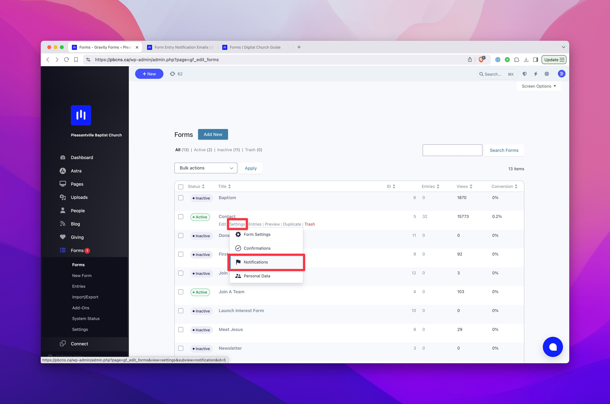
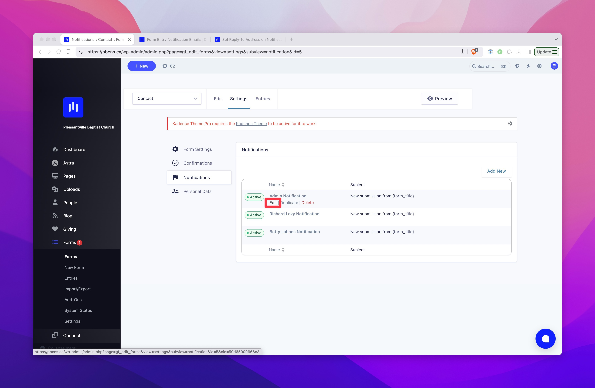
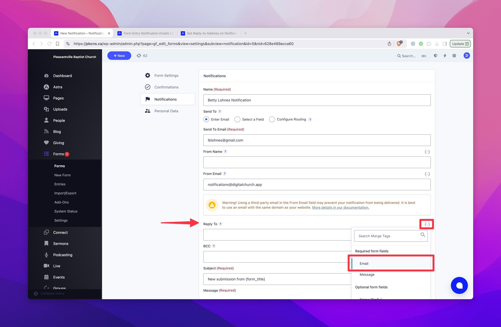

# Set Reply-To Address on Notifications

Email notifications from form entries typically have a "From" address that you wouldn't want to reply to directly. For example, our forms come from "notifications@digitalchurch.app" by default. In many cases, they may also come from a "no-reply" address or an address from your own domain. In most cases, you'll want to set a reply-to address that uses one of the fields in the form. For instance, if one of your church members submits a contact form asking about an upcoming event, you will want to be able to hit reply to email them the details. This guide will show you how to do that.

### 1. Find the Form

Go to Forms in your dashboard and hover over the form you wish to work on. You'll see a link to Notifications, where you can manage all the email notifications that are triggered by the form.

### 2. Edit the Notification

Find the notification you want to edit and click on the edit button below the notification title.

### 3. Set the Reply-to Address

Find the **Reply-to Address** field and click on the `{..}` icon above it to find available merge tags. In most cases, you'll want to use the email field from the form so the replies can be delivered to the person who filled out the form. Be sure to scroll down and click on the "Update Notification" to save your changes.