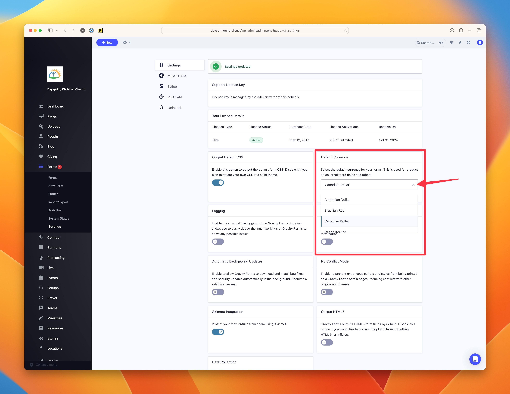

# Setting the Default Currency for Forms

By default, our form builder uses US Dollars. If you are in a different country, you likely want to accept payments in your currency.

## Changing the Default Currency

In your dashboard, go to **Forms > Settings** and you'll find an option for the Default Currency. Once you have selected the correct currency, scroll to the bottom of that page and click on the **Save Settings** button.

## Available Currencies

- U.S. Dollar
- Pound Sterling
- Euro
- Australian Dollar
- Brazilian Real
- Canadian Dollar
- Czech Koruna
- Danish Krone
- Hong Kong Dollar
- Hungarian Forint
- Israeli New Sheqel
- Malaysian Ringgit
- Mexican Peso
- New Zealand Dollar
- Norwegian Krone
- Philippine Peso
- Polish Zloty
- Russian Ruble
- Singapore Dollar
- South African Rand
- Swedish Krona
- Swiss Franc
- Taiwan New Dollar
- Thai Baht