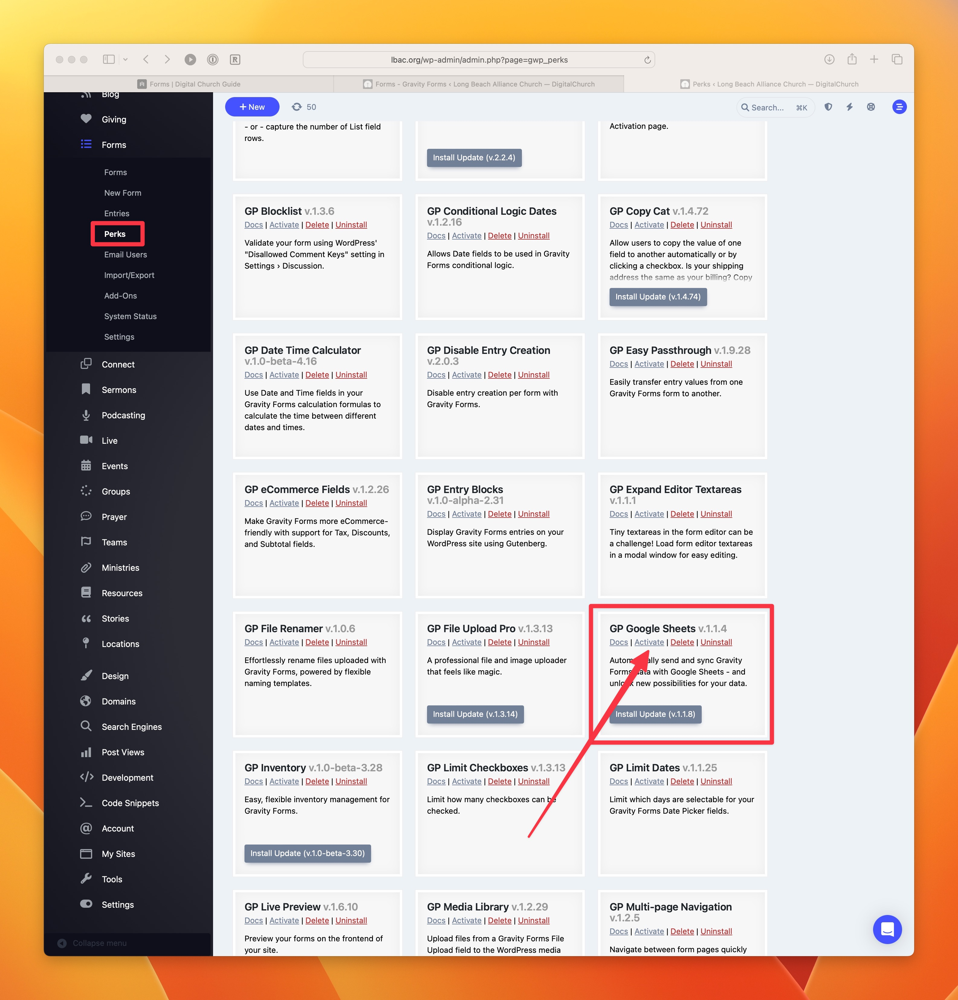
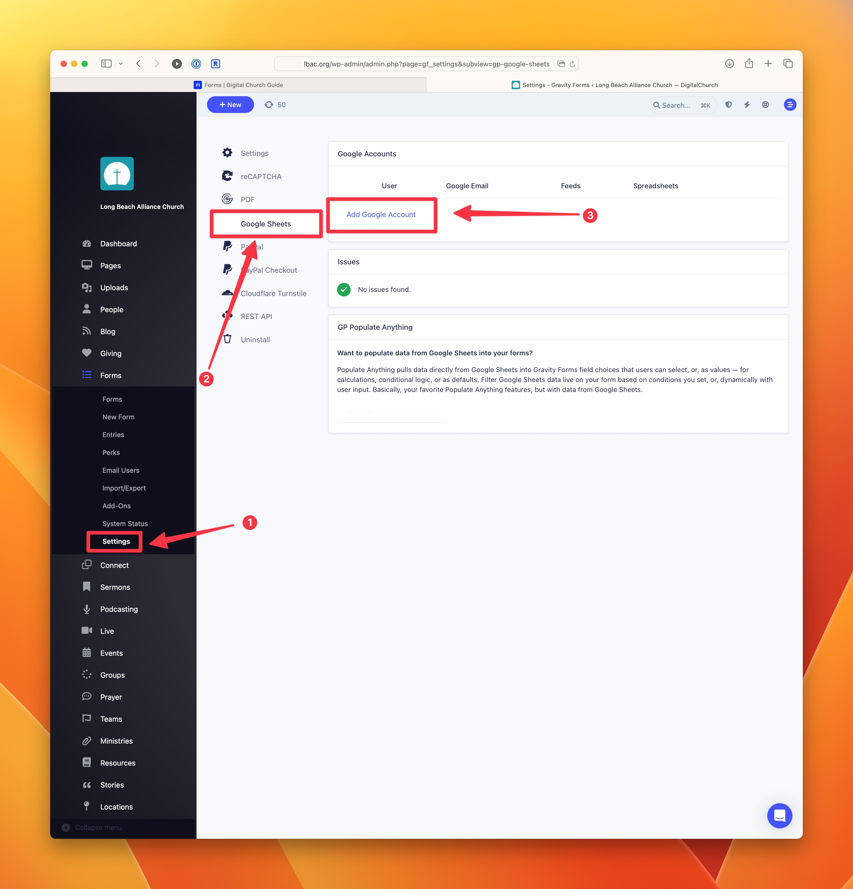
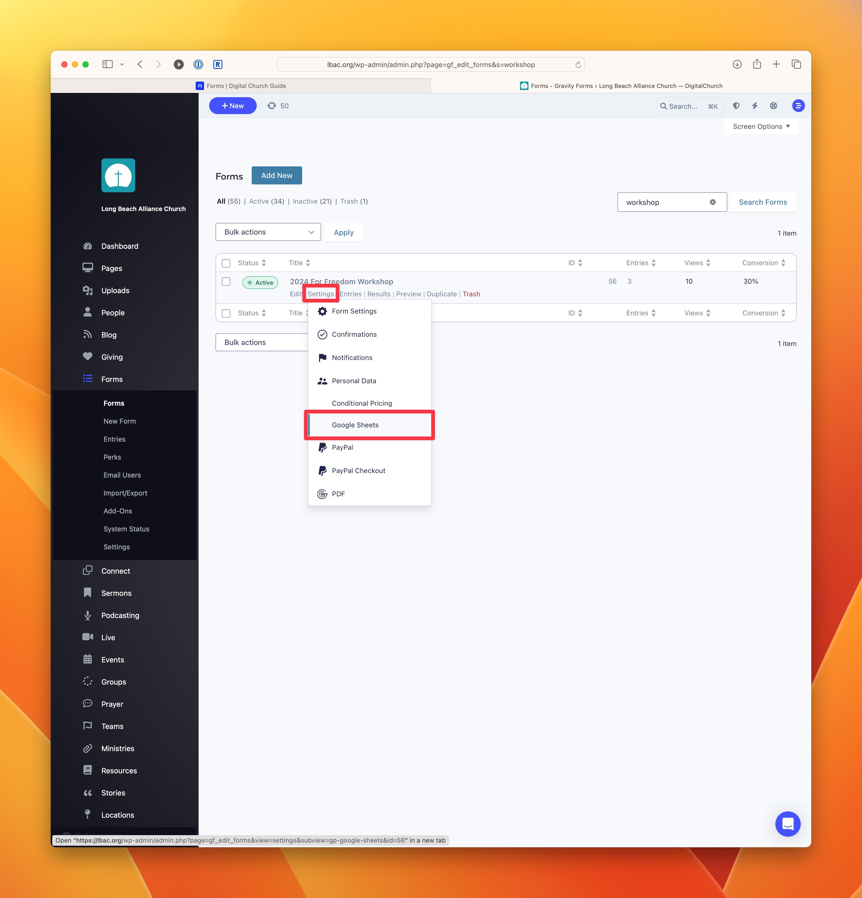
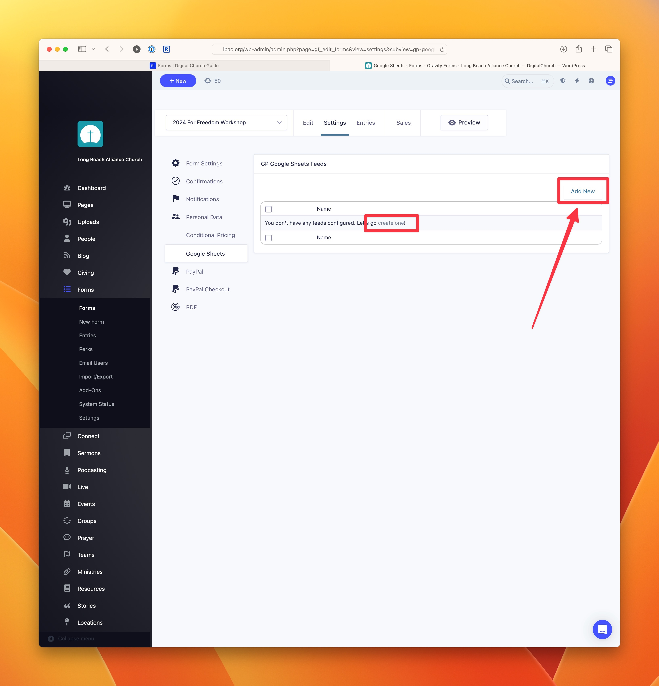

# Sync your Form Entries to Google Sheets

If you need to share form data with other people, a great approach is to sync the entries with Google Sheets and then share the spreadsheet with anyone who needs the data. This is great for event registrations in particular.

## Activate GP Google Sheets

:::note
This add-on is available as part of our Gravity Perks license. If you don't see Forms > Perks in the admin menu, you may need to activate Gravity Perks first.
:::

1. In the admin dashboard, go to **Forms > Perks**.
2. Click on Activate. If activation fails, activate it via **Settings > Plugins**

## Authorize your Google Sheets Account

Go to **Forms > Settings > Google Sheets** and click the **Add Google Account** button. Follow the process to give permission in your Google account.

## Edit Form Google Sheets Feeds

In the forms listing in **Dashboard > Forms**, find the form you want to keep in sync. Hover over the edit link below the form you wish to edit. Select "Google Sheets" from the dropdown menu.

## Add a New Feed

1. Click on the **Add New** button or the **create one** link to create a new Google Sheets feed.
2. Select the correct authorized account.
3. Select **Add New Spreadsheet** (or connect an exisiting spreadsheet if desired).
4. In the column mapping section, set up Column Headings for each value in your form.

:::note
If your form already has entries, you may want to go ahead and export the form data and import it into Google Sheets from a CSV file to get started.
:::