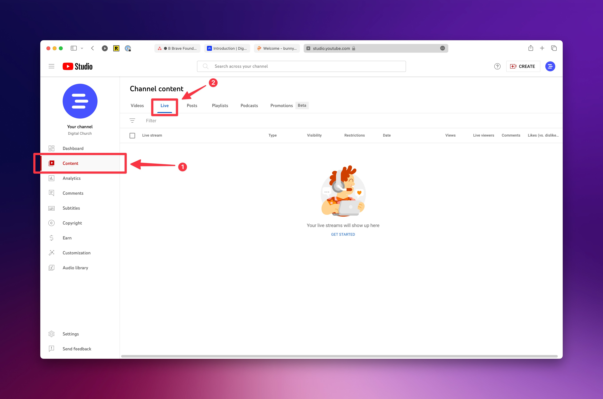

# Livestream Troubleshooting

## YouTube

### Live Stream Not Showing on Website

For YouTube livestreams, we use an iframe that YouTube provides for your channel's current live streams. If you're live stream isn't showing up on your website when you are live, there may be an issue in your account that is preventing your current live stream from pushing out to that iframe. Here are a few items to check to help troubleshoot issues with your YouTube live stream.

#### Is your channel livestream showing on youtube.com?

First, you should check your channel on a separate device to ensure that you see the livestream. Your livestream should be visible publicly, so you should be able to see it when you are not logged into YouTube.

#### Check Your Channel for Old Scheduled Live streams

If you previously scheduled a live stream that didn't take place, those scheduled streams might prevent your current streams from showing in your embed. To check on that, go to https://studio.youtube.com/ and visit the **Content** page found on the left side. From there, visit the **Live** tab and look for any old livestreams. If you find any, be sure to delete them.

