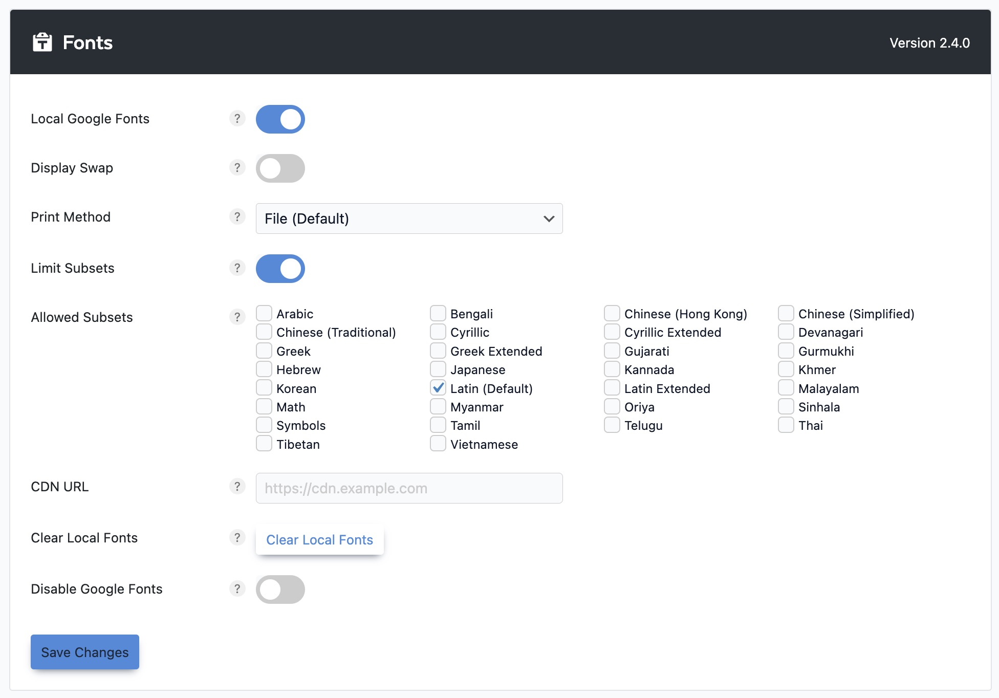

# Recommended Settings for Performance

We use a third-party plugin called [Perfmatters](https://perfmatters.io/) to optimize the performance of our websites. Below you will find recommended settings for the plugin. You can find the plugin in the WordPress dashboard under **Settings > Performance**.

## General

## Javascript

## CSS

## Preloading

## Lazy Loading

## Fonts

- Local Google Fonts: `TRUE`
- Display Swap: `FALSE`
- Print Method: `File (Default)`
- Limit Subsets: `TRUE`
- Allowed Subsets: `Latin (Default)`
- CDN URL: `blank`
- Disable Google Fonts: `FALSE`

## CDN

## Analytics

## Code

## Tools

## Database

## License

## Support