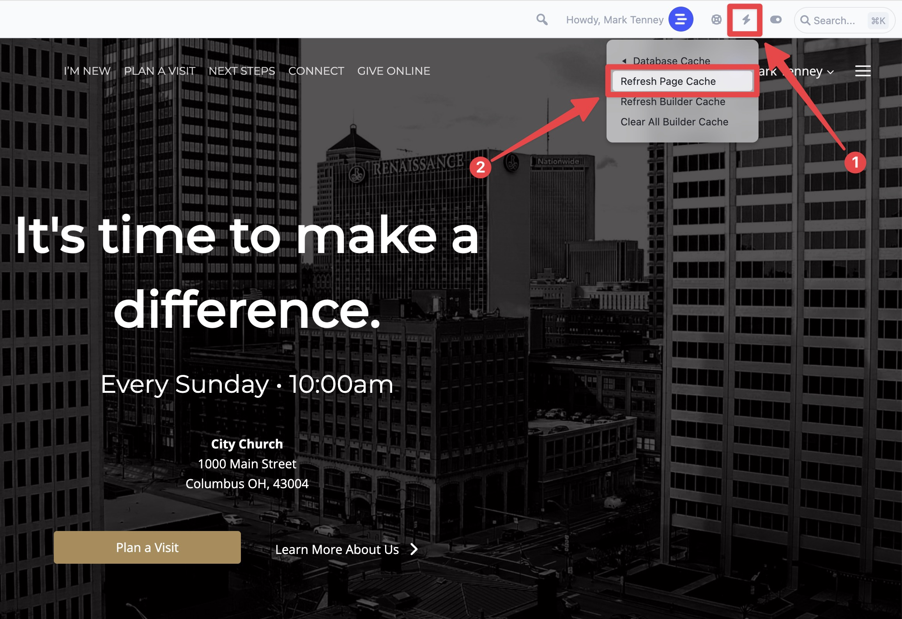
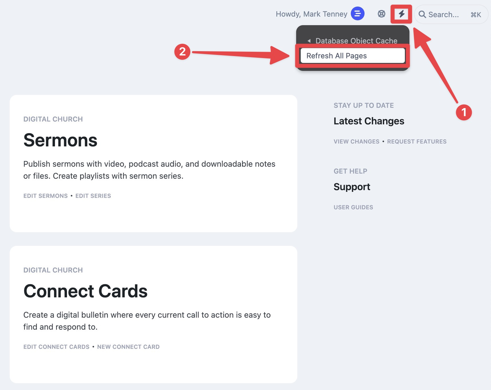

# Clearing Your Cache

Let's say you've edited something on your website, and you are able to verify the changes when you are logged in, but you don't see the changes showing up on devices that you aren't logged in on? Perhaps you check your mobile device and don't see the changes taking place there. Maybe you open up an incognito or private window in your browser and find that the changes don't display correctly there, either. This issue is almost always caused by cache that hasn't been refreshed with the latest content. First, let's explain how cache works.

### How Cache works

Cache is an elusive thing for people who don't have much experience with it, so we'll do our best to explain. You see, your website is stored in a database, and in order for a website browser to know what to load for your page, it checks for a specific file on the server. That file tells the browser what data to pull from the database.

Database powered websites are much more capable than the original static websites from the 90s. Databases allow us to store and organize all the website content and post data is a logical way so that data can be used by multiple pages across a website, or even be made available to a native app or other website through an API.

The downside with database driven websites is that they are inherently slow. Every page that loads needs to pull multiple pieces of data from the website to display the page. This is why we use a caching system.

The cache layers reside between the user's web browser and the database. When the first user loads a particular page, the cache saves that page in a static format so the database doesn't need to be checked again and again for each subsequent page load. The cache lives on the webserver, but it protects the database from being bogged down by multiple visits for the same data.

When a new user visits a page that was previously cached, their browser downloads the cached version and stores it on the local machine. This is why you've probably experienced the need to "Clear your browser cache" when you've had some sort of issue with a website. So the cache lives on the server and is also saved on the device in the hands of the end user.

The result of a cached website is that it loads faster. When someone visits a site, their device will first check to see if it already has a version of the page in it's local cache. It will generally check that against the webserver to make sure it's the same version that it sees on the server (although some browsers may not do that without closing the previously opened tab or quitting the browser entirely). If the version is the same as what's on the server, there isn't a need to re-download it again.

Basically, cache makes the internet faster. But it relies on the website being able to clear the right cache files at the right times to make sure any changes to the database are reflected in the browser next time someone visits.

### When does the cache not refresh automatically?

Every website host is different, but our system uses something called Redis Page Cache to build and manage cache files. We set up our sites to automatically refresh the cache in most cases. For instance, let's say you add a new sermon. The /sermons page on your website is usually not a static page. It's usually a post type archive page. While it does display just like a page at the /sermons url, it's actually a template system that is designed to show the latest sermons.

So in this case, when you publish a new sermon, our system knows to clear the old cache at /sermons so that the next visitor will generate a fresh cache file that will keep that /sermons archive up to date.

But what if you are using a special module to show your sermons on the home page?

Well, our system doesn't always know if you've added dynamic posts to static pages. So you might need to take a moment to manually clear the cache on those particular pages. You can also clear the cache sitewide if you need to.

### How do I clear the cache on a specific page?

Fortunately, we've made it pretty simple to clear the page cache. Just visit that page when you are logged in. You'll probably see the correct data, because when you are logged in as an editor or admin, all page cache is completely bypassed. Look in the top right corner of the admin toolbar and you'll see a small lightning bolt icon. This is our performance menu. Hover over the icon and click on the option to "Clear Page Cache" as seen in the image below.

This should clear the cache for the page you are viewing. It's always a good idea to open a new incognito or private tab and check just to be sure.

### How do I clear the cache on the whole site?

To clear the cache for the entire site, you'll need to be in the admin dashbaord area. Look for the performance menu with the same lightning bolt icon as before, and this time select the option to "Refresh All Pages".

:::note
Clearing the cache on the whole site will slow down the initial page load for every page on your site while the database is checked for the most up to date information. In some cases, it can cause your site to not load at all for a minute or two, so you should only use this option when you know you need to.
:::

Again, it's always a good idea to view your site from an incognito or private window. In fact, you can go ahead and generate the new cache files by visiting some of the most visited pages on your site. Once you've hit each of those pages once, new cache files will have been generated. If you want to see the affect of caching, you can then load a few of the pages one more time in a new incognito or private window and see how fast your site loads.

If you have any further trouble after working through this guide, please reach out to our support team and they will be glad to help.