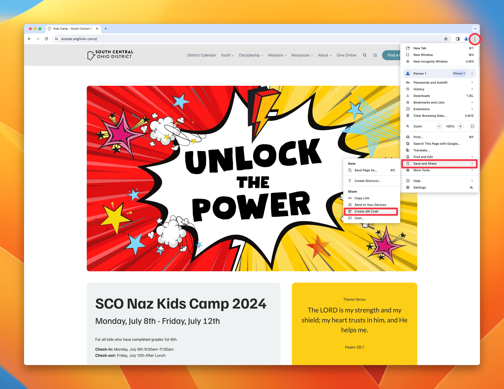

# Generate a QR Code for your Website

Often, when people start hunting down a way to generate a QR code for their website, they end up paying for some redirect service or app that includes click tracking. Fortunately, none of that is necessary if you just want a QR code. In fact, it’s really easy and free to generate one for ANY website URL in Google Chrome.

1. Open the link you want the QR code to land in Google Chrome.
2. In the menubar, click on the three vertical dots on the right side.
3. Hover over *Save and Share*.
4. Click on Create QR Code.
5. Download the QR code using the download button. (You can add tracking UTM parameters in the text box as well, if you’re into that.)