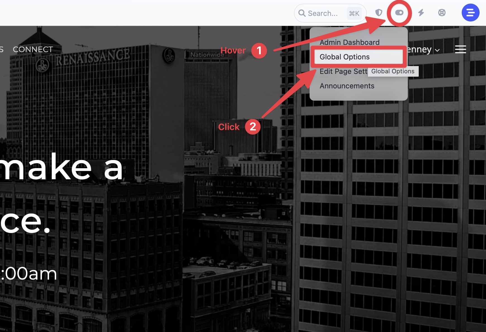
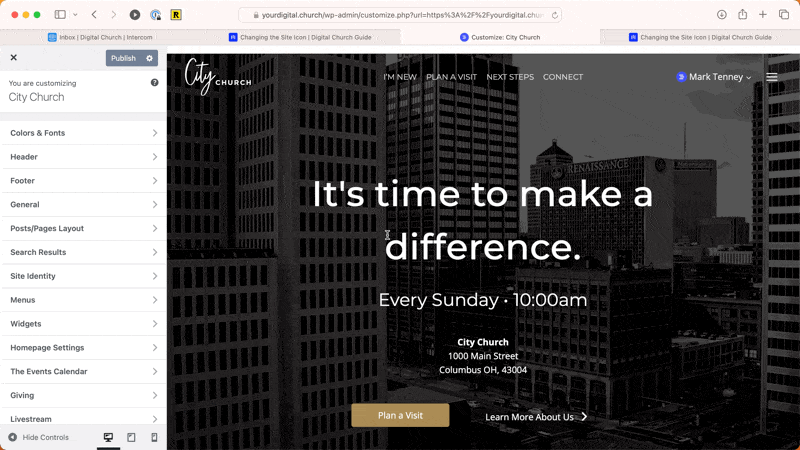
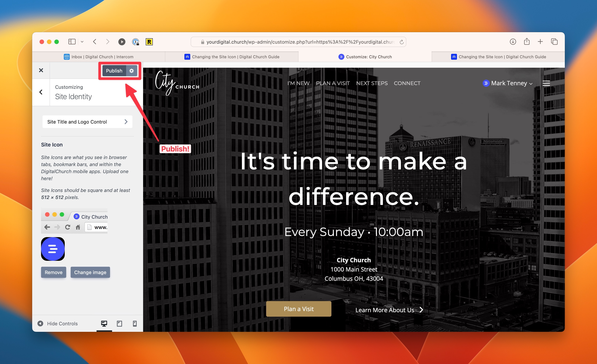

# Change the Site Icon

The site icon (also known as the *favicon*) is the small icon that shows up in the browser tabs when viewing your website. If you don't have a site icon set, you might see the Digital Church logo show up by default. If you'd like to use your own site icon, follow the instructions below.

In the Global Options for your website, you can change the site icon (also called a favicon).

## Access the Global Options

First, hover over the settings icon in the admin toolbar and then click on Global Options.

## Navigate to the Site Icon Panel

Navigate to **Header > Logo > Site Icon** and set the image there. You should use a square PNG file that is 512x512 pixels.

## Publish your changes

Don't forget to publish your changes!

