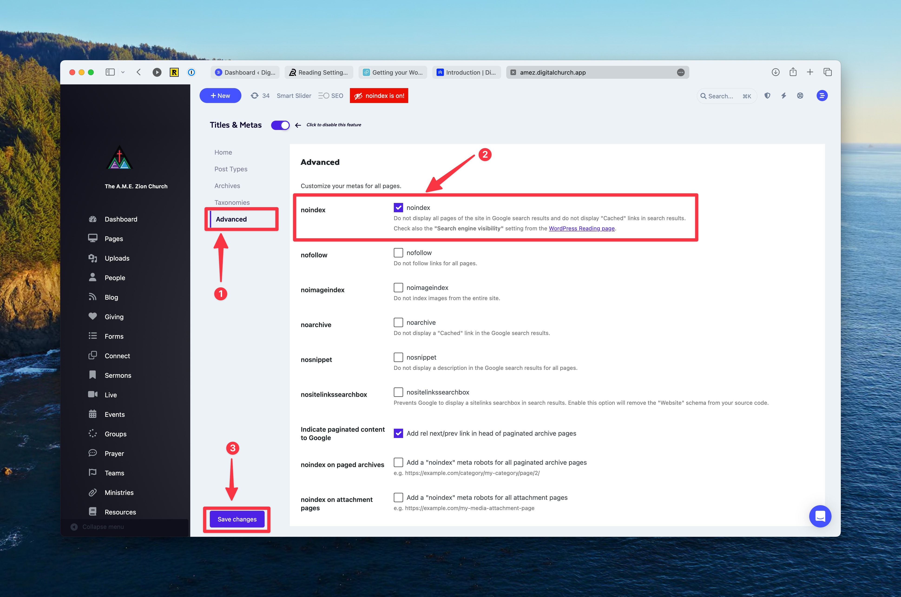
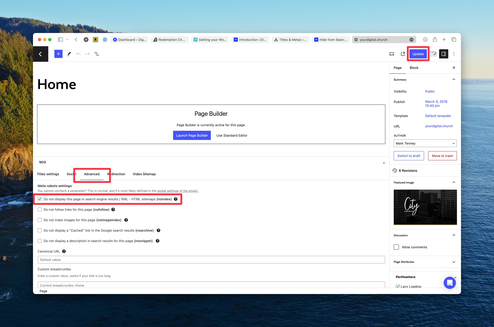

# Hide your Website from Search Engines

Sometimes you want to hide a website from search engines. For example, perhaps you don't want your new website to be accessible to anyone who doesn't have a direct link until you are ready to launch the new website. This guide will explain how to hide your entire site or specific posts/pages from search engine results.

:::note
While we can set our preferences on the website, it is ultimately up to the search engine (i.e. Google, Bing, etc.) if they wish to honor your request to keep your website out of their search results. The only way to guarantee that someone can't access your web content is to put it behind a user authentication system (in other words, force the user to login to your website to view it).
:::

## Set noindex on entire website

There are two ways you can set the entire website to noindex (which is what asks search engines to not include your website in their search results index). The first way is in the standard WordPress reading options under **Settings > Reading***. At the bottom of that page, you'll find an option to "Discourage search engines from indexing this site" that you can select and save. Our suggested method uses our Search Engine Optimization features. We suggest this because it will add a reminder flag in your admin bar that your site is set to noindex. This is handy to make sure you don't forget to change this setting later. Here's how you do that:

1. In the dashboard, go to **Search Engines > Titles & Metas > Advanced**.
2. The very first option on that page should allow you to set `noindex`.
3. Save your changes.

## Set a Specific Page/Post to noindex

To hide just as specific page or post from search engine results, you can set noindex on just that page or post.

1. Visit the dashboard editing interface for the page or post you want to edit. (Not the page builder)
2. You should see an SEO panel at the bottom of the page. If not, you may need to toggle the panel visibility. (To do that, click on the three dots in the top-right corner and visit the preferences for the editor.)
3. In the SEO Panel, visit the **Advanced** tab.
4. Select the option to **Do not display this page in search engine results / XML - HTML sitemaps (noindex)**.
5. Don't forget to **Update** the post to save your changes.