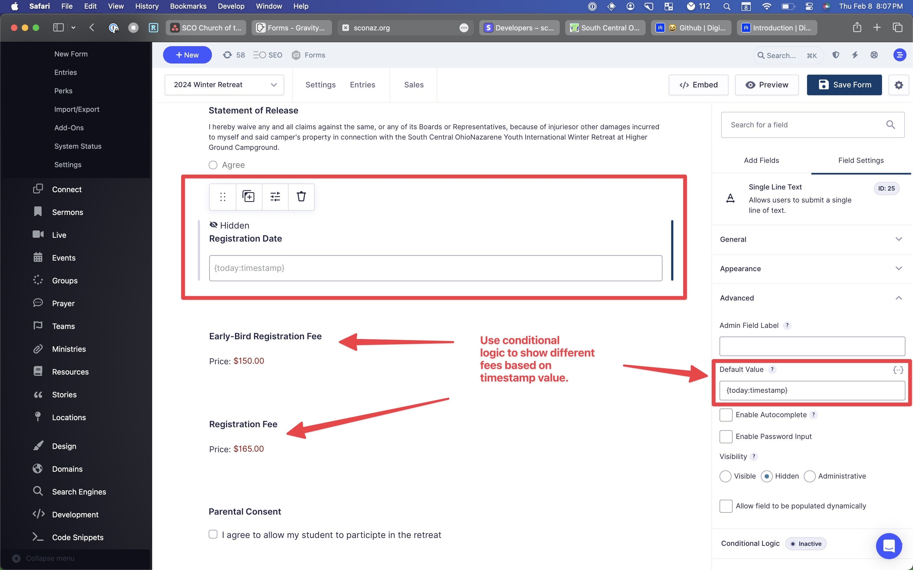

# Early Bird Registration

Sometimes you might want to set up two different prices for an event registration or some other kind of form you are building. To do this, we'll use something called **PHP Timecode** which is the number of seconds that have passed since January 1, 1970 0:00 UTC. You can use various online tools to convert your target transition time to a timecode value, and then you can use greater-than and less-than conditional logic to activate two different prices. Here's how you'd do it:

## Add a hidden text field to capture the current time.

1. Drag a number field into your form. (Do not use a date field)
2. In the **Advanced** section of the **Field Settings** you can add a **Default Value** of `{today:timestamp}` to capture the current timestamp.
3. To hide the field from the user, set it as a hidden field in the **Visibility** section just below the Default Value field.