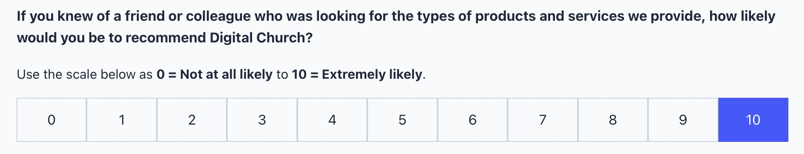

# Display Form Radio Buttons as a Grid of Buttons

This is a great approach for ratings form fields like "Rate our product from 0-10". In fact, we use this exact approach on our Goodbye form that we use to gather feedback from clients who leave our platform. We deeply beleive that honest feedback is one of the most important things we can receive, so we want to make it very easy for people to provide that feedback. You can see the form here: [https://digitalchurch.com/goodbye/](https://digitalchurch.com/goodbye/)



You'll need to add the `.radiobutton` class to the radio form field first. But then, you can just add this CSS in the Page Builder Layout CSS settings and that should do it.

```css
.gform_wrapper .gfield.radiobutton ul.gfield_radio li[class^="gchoice"] label:after {
    display:none;
}

body .gform_wrapper .gfield.radiobutton .gfield_radio li label {
    margin-left:0;
}

.gform_legacy_markup_wrapper label.gfield_label, .gform_legacy_markup_wrapper legend.gfield_label {
    font-size:20px;
}

/* Buttonize Radio & Checkbox Fields */
 .gform_wrapper .gfield.radiobutton .gfield_radio .gchoice {
    text-align: center;
 }
 .gform_wrapper .gfield.radiobutton input[type="radio"] {
    position: absolute;
    left: -9999px;
 }
 .gform_wrapper .gfield.radiobutton .gfield_radio label {
    display: block !important;
    position: relative;
    max-width: 100%;
    padding: 12px 0;
    font-size: 16px;
    border: 1px solid #cbd5e0;
    background-color: #f9fafc;
    cursor: pointer;
 }
 .gform_wrapper .gfield.radiobutton input[type="radio"]:focus+label {
    border-color: #040404;
 }
 .gform_wrapper .gfield.radiobutton input[type="radio"]:checked+label {
    border-color: #4452ff;
    background-color: #4452ff;
    color:#ffffff;
    overflow: hidden;
 }
 .gform_wrapper .gfield.radiobutton .gfield_radio label::before {
    display: none;
 }
 
 /* Layout Buttonized Inputs As Grid */
 .gform_wrapper .gfield.radiobutton .gfield_radio {
    display: grid;
    grid-template-columns: repeat( 11, 1fr ); /* This is for 11 columns. */
    grid-gap: 0;
 }
 ```